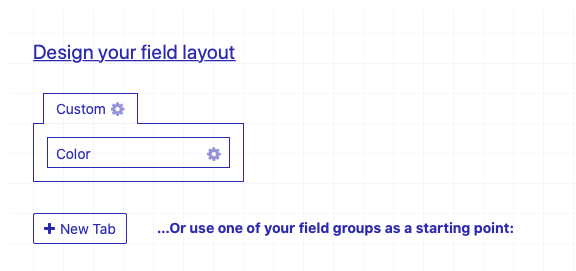
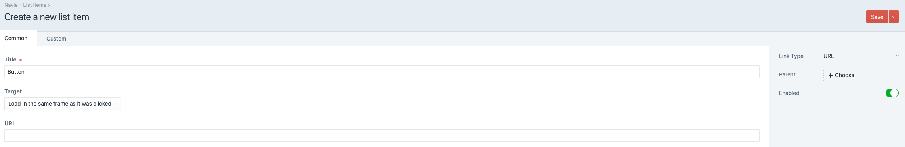
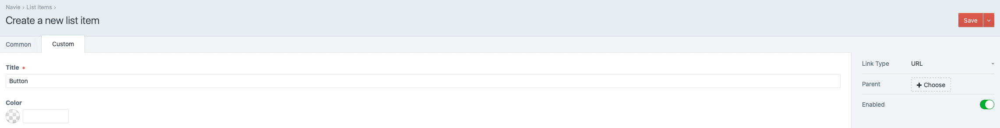

# Navie plugin for Craft CMS 3.x

Navigation plugin for Craft CMS 3 with GraphQL and custom field support.
Navie allow's you to add custom fields to your navigation items.




Add custom fields




Add link to list



Use custom fields

## Requirements

This plugin requires Craft CMS 3.0.0 or later.

## Installation

To install the plugin, follow these instructions.

1. Open your terminal and go to your Craft project:

        cd /path/to/project

2. Then tell Composer to load the plugin:

        composer require dutchheight/craft-navie

3. In the Control Panel, go to Settings → Plugins and click the “Install” button for Navie.

4. Create a list

5. Render in template. See [Display a navie list](#display-a-navie-list)

## Navie Features
- Multiple menus/lists
- Multisite support
- GraphQL support
- Default linktypes (Enrty, Url, Categorie)
- Add custom linktypes per menu by adding fields
- Rich API
- Editable plugin name
- Permissions (manage lists and edit settings)
- Permissions for each list (show, create, edit and delete)

## Using Navie with Twig

### Display a navie list
`craft.navie.render(handle, options)` is used to display a list. You can provide styling options.

| Attribute | Type | Required | Description |
|:----------|:-----|:---------|:------------|
|handle|string|true|handle specified in the settings|
|options|object|false|For more info see [Available Options](#available-options)|

#### Available Options
```
{
	ulClass: 'class',
	ulAttributes: {
		'style': 'margin-top: 10;'
	},
	ulChildClass: 'class',
	ulChildAttributes: {
		'style': 'margin-top: 10;'
	},
	listClass: 'class',
	listAttributes: {
		'style': 'margin-top: 10;'
	},
	linkClass: 'class',
	linkAttributes: {
		'style': 'margin-top: 10;'
	},
	linkActiveClass: 'active'
}

```

#### Examples
Render a navie list:
```
{{ craft.navie.render('main', {
	ulChildAttributes: {
		'style': 'margin-top: 0.25rem;',
		'data-option': 'test',
	}
}) }}
```
---

### Raw navie list
`craft.navie.items(criteria)` is used to get a list. [Check Craft Element queries for more info](https://docs.craftcms.com/v3/dev/element-queries/)

| Attribute | Type | Required | Description |
|:----------|:-----|:---------|:------------|
|criteria|array|false|Craft entry criteria|


#### Examples
All items
```
craft.navie.items().list('main').all()
```

Limit by level
``` 
craft.navie.items()
.list('main')
.level(1) %}

```
---

## Using Navie with GraphQL

#### Examples
```
{
  listItems(list: "main", level: 1) {
    id,
    title,
    url,
    target,
    children {
      id,
      url,
      title,
      target,
      ... on main { // Main is listhandle/ Get custom fields
        classes
      }
    }
  }
}
```
---

## Navie Roadmap

Some things to do, and ideas for potential features:

* Release it
* Settings for available link types
* Support Project.yaml
* Custom link type registration

Brought to you by [Dutch Height](https://www.dutchheight.com)
